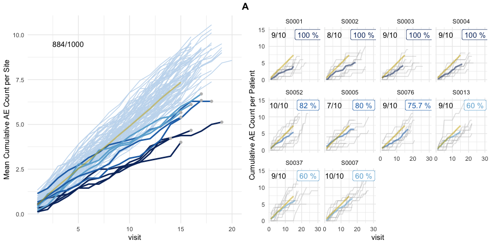
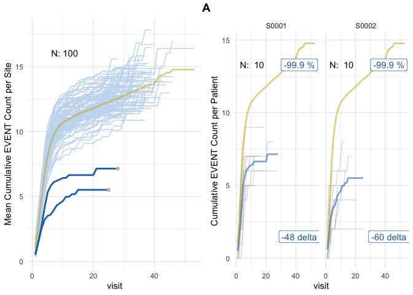
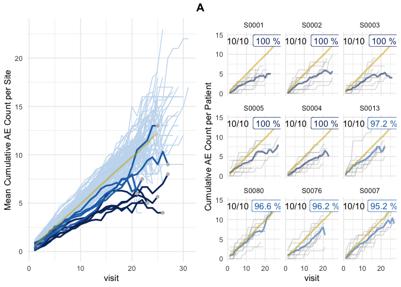

<!-- README.md is generated from README.Rmd. Please edit that file -->

# simaerep <a href='https://openpharma.github.io/simaerep/'></a>

<!-- badges: start -->

[](https://github.com/openpharma/simaerep/actions)
[](https://app.codecov.io/gh/openpharma/simaerep)
[](https://lifecycle.r-lib.org/articles/stages.html#experimental)
[](https://github.com/openpharma/simaerep/actions/workflows/validation.yml)
[](https://CRAN.R-project.org/package=simaerep)
<!-- badges: end -->

Simulate adverse event reporting in clinical trials with the goal of
detecting under-reporting sites.

Monitoring of Adverse Event (AE) reporting in clinical trials is
important for patient safety. We use bootstrap-based simulation to
assign an AE under-reporting probability to each site in a clinical
trial. The method is inspired by the ‘infer’ R package and Allen
Downey’s blog article: [“There is only one
test!”](http://allendowney.blogspot.com/2011/05/there-is-only-one-test.html).

## Installation

### CRAN

``` r
install.packages("simaerep")
```

### Development Version

You can install the development version from
[GitHub](https://github.com/) with:

``` r
# install.packages("devtools")
devtools::install_github("openpharma/simaerep")
```

## IMPALA

`simaerep` has been published as workproduct of the Inter-Company
Quality Analytics ([IMPALA](https://impala-consortium.org/)) consortium.
IMPALA aims to engage with Health Authorities inspectors on defining
guiding principles for the use of advanced analytics to complement,
enhance and accelerate current QA practices. `simaerep` has initially
been developed at Roche but is currently evaluated by other companies
across the industry to complement their quality assurance activities
([see
testimonials](https://impala-consortium.org/clinical-safety-reporting-work-product-stream/)).

[](https://impala-consortium.org/)

## Publications

Koneswarakantha, B., Adyanthaya, R., Emerson, J. et al. An Open-Source R
Package for Detection of Adverse Events Under-Reporting in Clinical
Trials: Implementation and Validation by the IMPALA (Inter coMPany
quALity Analytics) Consortium. Ther Innov Regul Sci 58, 591–599 (2024).
<https://doi.org/10.1007/s43441-024-00631-8>

Koneswarakantha, B., Barmaz, Y., Ménard, T. et al. Follow-up on the Use
of Advanced Analytics for Clinical Quality Assurance: Bootstrap
Resampling to Enhance Detection of Adverse Event Under-Reporting. Drug
Saf (2020). <https://doi.org/10.1007/s40264-020-01011-5>

## Tutorials

- [video presentation 15
  min](https://vimeo.com/776275791?embedded=true&source=vimeo_logo&owner=189858368)
- [Documentation with Vignettes](https://openpharma.github.io/simaerep/)

## Validation Report

Download as pdf in the [release
section](https://github.com/openpharma/simaerep/releases) generated
using
[thevalidatoR](https://github.com/insightsengineering/thevalidatoR/).

## Application

Recommended Threshold: `aerep$dfeval$prob_low_prob_ur: 0.95`

``` r

suppressPackageStartupMessages(library(simaerep))
suppressPackageStartupMessages(library(tidyverse))
suppressPackageStartupMessages(library(knitr))

set.seed(1)

df_visit <- sim_test_data_study(
  n_pat = 1000, # number of patients in study
  n_sites = 100, # number of sites in study
  frac_site_with_ur = 0.05, # fraction of sites under-reporting
  ur_rate = 0.4, # rate of under-reporting
  ae_per_visit_mean = 0.5 # mean AE per patient visit
)

df_visit$study_id <- "A"

df_visit %>%
  select(study_id, site_number, patnum, visit, n_ae) %>%
  head(25) %>%
  knitr::kable()
```

| study_id | site_number | patnum  | visit | n_ae |
|:---------|:------------|:--------|------:|-----:|
| A        | S0001       | P000001 |     1 |    0 |
| A        | S0001       | P000001 |     2 |    1 |
| A        | S0001       | P000001 |     3 |    1 |
| A        | S0001       | P000001 |     4 |    2 |
| A        | S0001       | P000001 |     5 |    3 |
| A        | S0001       | P000001 |     6 |    3 |
| A        | S0001       | P000001 |     7 |    3 |
| A        | S0001       | P000001 |     8 |    3 |
| A        | S0001       | P000001 |     9 |    3 |
| A        | S0001       | P000001 |    10 |    3 |
| A        | S0001       | P000001 |    11 |    3 |
| A        | S0001       | P000001 |    12 |    3 |
| A        | S0001       | P000001 |    13 |    4 |
| A        | S0001       | P000001 |    14 |    4 |
| A        | S0001       | P000001 |    15 |    4 |
| A        | S0001       | P000001 |    16 |    6 |
| A        | S0001       | P000001 |    17 |    6 |
| A        | S0001       | P000002 |     1 |    0 |
| A        | S0001       | P000002 |     2 |    0 |
| A        | S0001       | P000002 |     3 |    0 |
| A        | S0001       | P000002 |     4 |    0 |
| A        | S0001       | P000002 |     5 |    0 |
| A        | S0001       | P000002 |     6 |    0 |
| A        | S0001       | P000002 |     7 |    0 |
| A        | S0001       | P000002 |     8 |    1 |

``` r

aerep <- simaerep(df_visit)

plot(aerep, study = "A")
```



*Left panel shows mean AE reporting per site (lightblue and darkblue
lines) against mean AE reporting of the entire study (golden line).
Single sites are plotted in descending order by AE under-reporting
probability on the right panel in which grey lines denote cumulative AE
count of single patients. Grey dots in the left panel plot indicate
sites that were picked for single plotting. AE under-reporting
probability of dark blue lines crossed threshold of 95%. Numbers in the
upper left corner indicate the ratio of patients that have been used for
the analysis against the total number of patients. Patients that have
not been on the study long enough to reach the evaluation point
(visit_med75, see introduction) will be ignored.*

## Optimized Statistical Performance

Following the recommendation of our latest [performance
benchmark](https://openpharma.github.io/simaerep/articles/performance.html)
statistical performance can be increased by using the
[inframe](https://openpharma.github.io/simaerep/articles/inframe.html)
algorithm without multiplicity correction.

**Note that the plot is more noisy because no patients are excluded and
only a few patients contribute to the event count at higher visits**

Recommended Threshold: `aerep$dfeval$prob_low_prob_ur: 0.99`

``` r
aerep <- simaerep(
  df_visit,
  inframe = TRUE,
  visit_med75 = FALSE,
  mult_corr = FALSE
)

plot(aerep, study = "A")
```



## In Database Calculation

The
[inframe](https://openpharma.github.io/simaerep/articles/inframe.html)
algorithm uses only `dbplyr` compatible table operations and can be
executed within a database backend as we demonstrate here using
`duckdb`.

However, we need to provide a in database table that has as many rows as
the desired replications in our simulation, instead of providing an
integer for the `r` parameter.

``` r
con <- DBI::dbConnect(duckdb::duckdb(), dbdir = ":memory:")
df_r <- tibble(rep = seq(1, 1000))

dplyr::copy_to(con, df_visit, "visit")
dplyr::copy_to(con, df_r, "r")

tbl_visit <- tbl(con, "visit")
tbl_r <- tbl(con, "r")


aerep <- simaerep(
  tbl_visit,
  r = tbl_r,
  inframe = TRUE,
  visit_med75 = FALSE,
  mult_corr = FALSE
)

plot(aerep, df_visit = tbl_visit)
#> study = NULL, defaulting to study:A
```



``` r

DBI::dbDisconnect(con)
```
