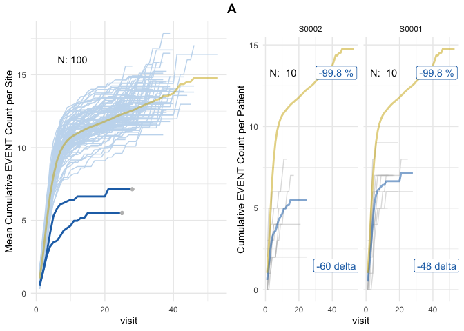

<!-- README.md is generated from README.Rmd. Please edit that file -->

# simaerep <a href='https://openpharma.github.io/simaerep/'></a>

<!-- badges: start -->

[](https://github.com/openpharma/simaerep/actions)
[](https://app.codecov.io/gh/openpharma/simaerep)
[](https://lifecycle.r-lib.org/articles/stages.html#experimental)
[](https://github.com/openpharma/simaerep/actions/workflows/validation.yml)
[](https://CRAN.R-project.org/package=simaerep)
<!-- badges: end -->

Simulate subject-level event reporting of clinical trial sites with the
goal of detecting over- and under-reporting.

Monitoring reporting rates of subject-level clinical events (e.g.
adverse events, protocol deviations) reported by clinical trial sites is
an important aspect of risk-based quality monitoring strategy. Sites
that are under-reporting or over-reporting events can be detected using
bootstrap simulations during which patients are redistributed between
sites. Site-specific distributions of event reporting rates are
generated that are used to assign probabilities to the observed
reporting rates.

The method is inspired by the ‘infer’ R package and Allen Downey’s blog
article: [“There is only one
test!”](http://allendowney.blogspot.com/2011/05/there-is-only-one-test.html).

## Installation

### CRAN

``` r
install.packages("simaerep")
```

### Development Version

You can install the development version from
[GitHub](https://github.com/) with:

``` r
# install.packages("devtools")
devtools::install_github("openpharma/simaerep")
```

## IMPALA

`simaerep` has been published as workproduct of the Inter-Company
Quality Analytics ([IMPALA](https://impala-consortium.org/)) consortium.
IMPALA aims to engage with Health Authorities inspectors on defining
guiding principles for the use of advanced analytics to complement,
enhance and accelerate current QA practices. `simaerep` has initially
been developed at Roche but is currently evaluated by other companies
across the industry to complement their quality assurance activities
([see
testimonials](https://impala-consortium.org/clinical-safety-reporting-work-product-stream/)).

[](https://impala-consortium.org/)

## Publications

Koneswarakantha, B., Adyanthaya, R., Emerson, J. et al. An Open-Source R
Package for Detection of Adverse Events Under-Reporting in Clinical
Trials: Implementation and Validation by the IMPALA (Inter coMPany
quALity Analytics) Consortium. Ther Innov Regul Sci 58, 591–599 (2024).
<https://doi.org/10.1007/s43441-024-00631-8>

Koneswarakantha, B., Barmaz, Y., Ménard, T. et al. Follow-up on the Use
of Advanced Analytics for Clinical Quality Assurance: Bootstrap
Resampling to Enhance Detection of Adverse Event Under-Reporting. Drug
Saf (2020). <https://doi.org/10.1007/s40264-020-01011-5>

## Resources

- [Slides PHUSE
  conference](https://phuse.s3.eu-central-1.amazonaws.com/Archive/2024/Connect/EU/Strasbourg/PRE_AR04.pdf)
- [Article PHUSE
  conference](https://phuse.s3.eu-central-1.amazonaws.com/Archive/2024/Connect/EU/Strasbourg/PAP_AR04.pdf)
- [video presentation 15
  min](https://vimeo.com/776275791?embedded=true&source=vimeo_logo&owner=189858368)
- [Documentation with Vignettes](https://openpharma.github.io/simaerep/)

## Validation Report

Download as pdf in the [release
section](https://github.com/openpharma/simaerep/releases) generated
using
[thevalidatoR](https://github.com/insightsengineering/thevalidatoR/).

## {gsm.simaerep}

We have created an extension
[gsm.simaerep](https://github.com/IMPALA-Consortium/gsm.simaerep) so
that `simaerep` event reporting probabilities can be added to good
statistical monitoring
[gsm.core](https://github.com/Gilead-BioStats/gsm.core) reports.

## Application

Calculate patient-level event reporting probabilities and the difference
to the expected number of events on a simulated data set with 2
under-reporting sites.

``` r

suppressPackageStartupMessages(library(simaerep))
suppressPackageStartupMessages(library(dplyr))
suppressPackageStartupMessages(library(knitr))

set.seed(1)

df_visit <- sim_test_data_study(
  n_pat = 1000, # number of patients in study
  n_sites = 100, # number of sites in study
  ratio_out = 0.02, # ratio of sites with outlier
  factor_event_rate = -0.5, # rate of under-reporting
  # non-constant event rates based on gamma distribution
  event_rates = (dgamma(seq(1, 20, 0.5), shape = 5, rate = 2) * 5) + 0.1,
  max_visit = 20,
  max_visit_sd = 10,
  study_id = "A"
)

df_visit %>%
  select(study_id, site_id, patient_id, visit, n_event) %>%
  head(25) %>%
  knitr::kable()
```

| study_id | site_id | patient_id | visit | n_event |
|:---------|:--------|:-----------|------:|--------:|
| A        | S0001   | P000001    |     1 |       0 |
| A        | S0001   | P000001    |     2 |       2 |
| A        | S0001   | P000001    |     3 |       2 |
| A        | S0001   | P000001    |     4 |       4 |
| A        | S0001   | P000001    |     5 |       6 |
| A        | S0001   | P000001    |     6 |       7 |
| A        | S0001   | P000001    |     7 |       7 |
| A        | S0001   | P000001    |     8 |       7 |
| A        | S0001   | P000001    |     9 |       7 |
| A        | S0001   | P000001    |    10 |       7 |
| A        | S0001   | P000001    |    11 |       7 |
| A        | S0001   | P000001    |    12 |       7 |
| A        | S0001   | P000001    |    13 |       7 |
| A        | S0001   | P000002    |     1 |       3 |
| A        | S0001   | P000002    |     2 |       3 |
| A        | S0001   | P000002    |     3 |       5 |
| A        | S0001   | P000002    |     4 |       8 |
| A        | S0001   | P000002    |     5 |       8 |
| A        | S0001   | P000002    |     6 |       9 |
| A        | S0001   | P000002    |     7 |       9 |
| A        | S0001   | P000002    |     8 |       9 |
| A        | S0001   | P000002    |     9 |       9 |
| A        | S0001   | P000002    |    10 |       9 |
| A        | S0001   | P000002    |    11 |       9 |
| A        | S0001   | P000002    |    12 |       9 |

``` r


evrep <- simaerep(df_visit, mult_corr = TRUE)

plot(evrep, study = "A")
```


*Left panel shows mean cumulative event reporting per site (blue lines)
against mean cumulative event reporting of the entire study (golden
line). Sites with either high under-reporting (negative probabilities)
or high over-reporting (positive probabilities) are marked by grey dots
and plotted in additional panels on the right. N denotes the number of
sites. Right panel shows individual sites with total patient cumulative
counts as grey lines. N denotes the number of patients, the percentage
the under- and over-reporting probability and 394 denotes the difference
compared to the expected number of events.*

## In Database Calculation

The
[inframe](https://openpharma.github.io/simaerep/articles/inframe.html)
algorithm uses only `dbplyr` compatible table operations and can be
executed within a database backend as we demonstrate here using
`duckdb`.

However, we need to provide a in database table that has as many rows as
the desired replications in our simulation, instead of providing an
integer for the `r` parameter.

``` r
con <- DBI::dbConnect(duckdb::duckdb(), dbdir = ":memory:")
df_r <- tibble(rep = seq(1, 1000))

dplyr::copy_to(con, df_visit, "visit")
dplyr::copy_to(con, df_r, "r")

tbl_visit <- tbl(con, "visit")
tbl_r <- tbl(con, "r")

evrep <- simaerep(
  tbl_visit,
  r = tbl_r
)

plot(evrep, study = "A")
```



``` r

DBI::dbDisconnect(con)
```
